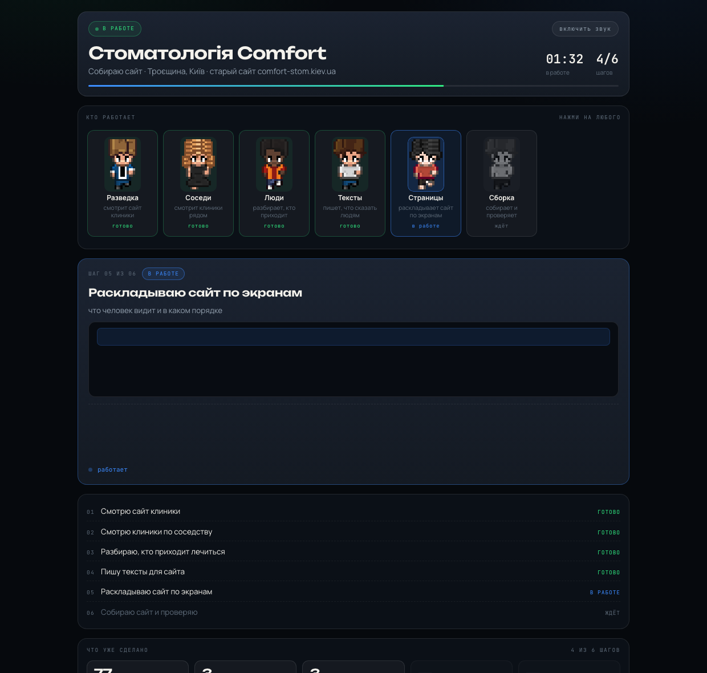
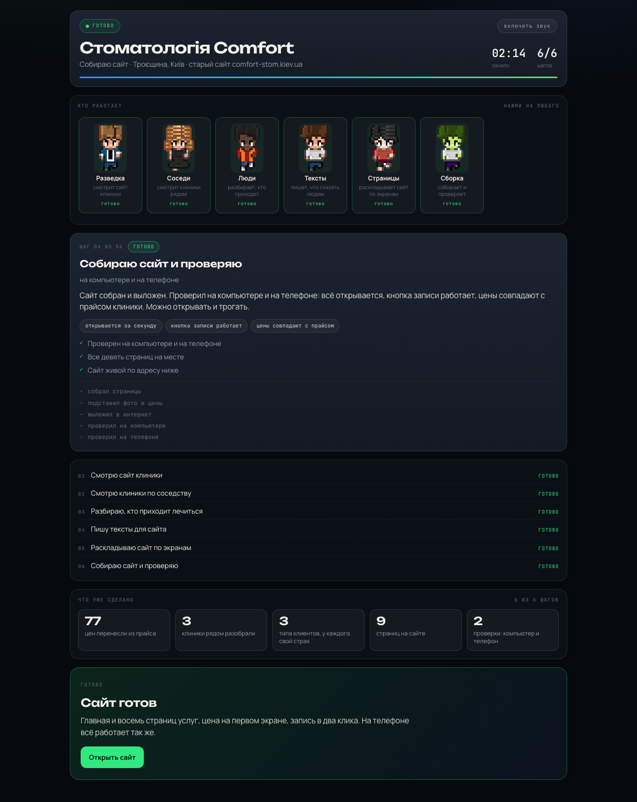

# Бизнес под ключ — скилл для Claude Code

Ставишь один раз и дальше пишешь обычным текстом: «сделай сайт», «сделай
продавца», «сделай видео», «запускай рекламу». Рядом с чатом открывается окно,
в котором команда специалистов по шагам делает работу, а в конце появляется
готовый результат по ссылке.

Окно — это артефакт Claude. После каждого шага он перевыкладывается по тому же
адресу: страница не переоткрывается, она дорастает на глазах.



## Поставить

```
mkdir -p ~/.claude/skills && curl -sL https://github.com/skipaoff/biznes-pod-klyuch/archive/refs/heads/main.tar.gz | tar -xz -C ~/.claude/skills && mv ~/.claude/skills/biznes-pod-klyuch-main ~/.claude/skills/biznes-pod-klyuch
```

Проверить, что всё на месте:

```
python3 ~/.claude/skills/biznes-pod-klyuch/proverka.py
```

Соберёт все четыре экрана, пересчитает портреты, дёрнет ссылки результатов
и скажет, чего не хватает. Снести — `rm -rf ~/.claude/skills/biznes-pod-klyuch`.

## Четыре куска работы

| Что пишешь | Идёт | Что в конце |
|---|---|---|
| вот инфа про бизнес, сделай сайт | 2:14 | сайт клиники |
| сделай продавца и видеоконсультанта | 2:18 | тот же сайт со звонком и Telegram |
| сделай видео | 2:10 | [готовый ролик](https://skipaoff.github.io/biznes-pod-klyuch/itogi/rolik/) |
| запускай рекламу | 2:38 | [объявление](https://skipaoff.github.io/biznes-pod-klyuch/itogi/obyavlenie/) |

Куски связаны: сайт со второго шага — тот же самый, что собрали на первом, только
к нему добавились звонок и Telegram. Ролик с третьего уходит в рекламу на четвёртом.

Перед рекламой агент один раз спрашивает: сколько тратим и где показываем —
Instagram, Facebook или и там, и там. Ответ попадает прямо на экран. Дальше он
сам рисует картинки к ролику, берёт район вокруг клиники, пишет тексты, делит
бюджет и включает.

## Что видно на экране

- **Команда сверху.** Нажми на любого — на месте работы откроется его карточка:
  что он делал и что у него вышло. Нажми ещё раз — вернётся работа.
- **Живая картинка работы.** Пока шаг идёт, видно не текст, а само дело: полоса
  разбора бежит по странице, строчки набираются, блоки встают на места, круги
  расходятся от клиники, растут полосы бюджета. Двенадцать видов работы, все на
  чистом CSS, без запросов наружу.
- **Звук.** Кнопка в правом верхнем углу: когда шаг закрывается, звенит.
- **Счёт снизу.** Цифры заполняются по мере готовности: сколько цен перенесли,
  сколько страниц собрали, сколько разговоров проверили.



## Как это устроено

| Что | Файл |
|---|---|
| движок экрана | `ekran.py`, `shablon.html` |
| шаг вперёд, сброс, финал, ответы | `shag.py` |
| картинки рекламы | `kreativy/`, `kreativy.py` |
| портреты команды | `lica/` |
| содержимое четырёх экранов | `shagi/*.json` |
| проверка перед эфиром | `proverka.py` |
| страницы результата | `itogi/` |

Состояние работы лежит в `shagi/<экран>.json`. Команда `shag.py <экран> <N>`
двигает его и собирает страницу в `build/`, а Claude публикует эту страницу
артефактом по одному и тому же пути. Ничего не выдумывается на ходу: что лежит
в состоянии, то и на экране.

Поменять бизнес — значит поменять `shagi/*.json`, а не код.

## Картинки рекламы

Кладутся в `kreativy/`: `1.jpg … 5.jpg` и `kabinet.png` — скриншот рекламного
кабинета с запущенными объявлениями. Ссылки на картинки — по одной в строке
в `ssylki.txt` там же. Потом `python3 kreativy.py`. Пока файлов нет, на экране
стоят подписанные рамки — ничего не ломается.

## Что нужно

Claude Code с инструментом Artifact и Python 3. Больше ничего: библиотек нет,
сборки нет, интернет нужен только чтобы открыть готовый результат.
